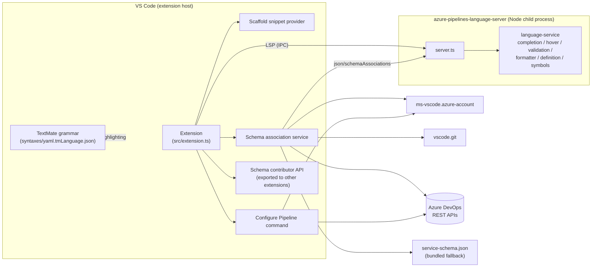
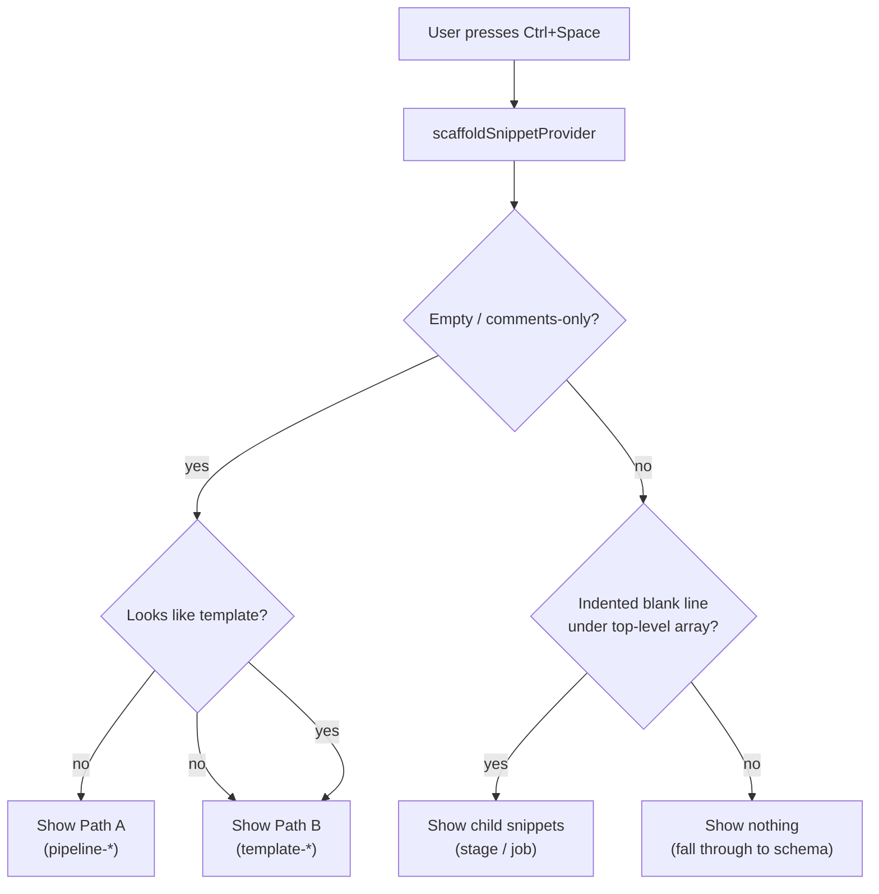
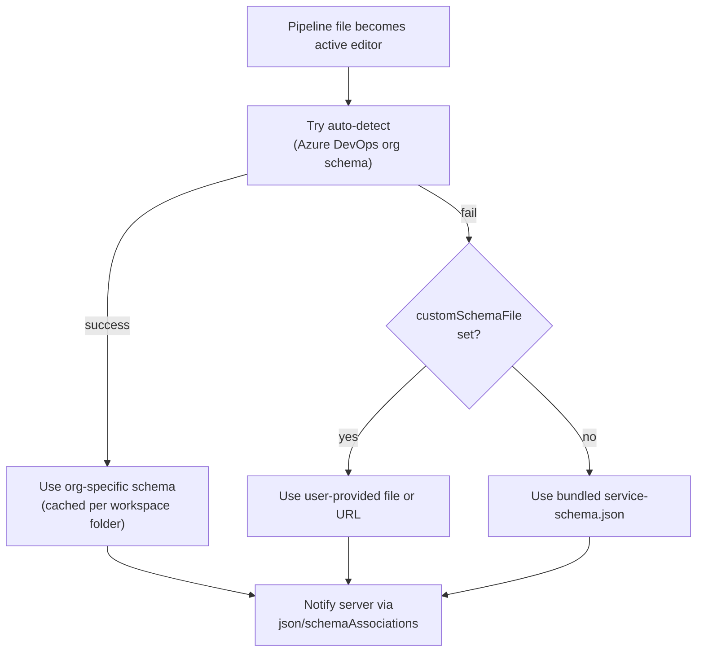
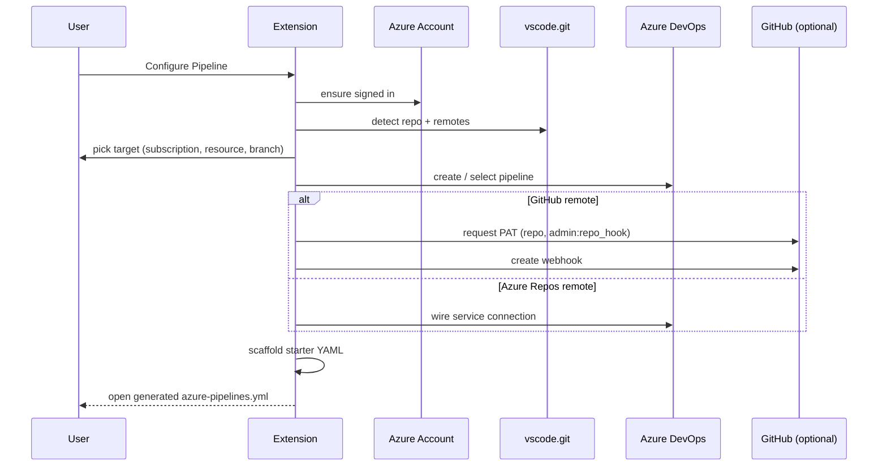
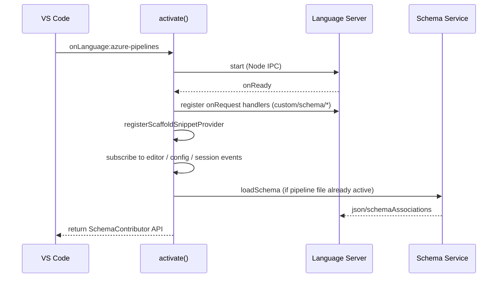

# Features

A complete inventory of what the **Azure Pipelines** extension contributes
to VS Code, what its language server provides, and how the moving parts fit
together.

> Sibling docs:
> - [scaffold-snippets.md](scaffold-snippets.md) — empty-file scaffold snippet feature.

---

## 1. At a glance

---

## 2. VS Code contributions (`package.json`)

Declared in [package.json](../package.json) under `contributes`.

| Contribution point     | What we register                                                                                  |
| ---------------------- | ------------------------------------------------------------------------------------------------- |
| `languages`            | Language id `azure-pipelines`, aliases, file-name patterns for well-known pipeline files          |
| `grammars`             | YAML TextMate grammar mounted on `source.yaml` for the `azure-pipelines` language                 |
| `configuration`        | Settings `azure-pipelines.configure`, `azure-pipelines.customSchemaFile`                          |
| `configurationDefaults`| Per-language editor defaults for `[azure-pipelines]` (2-space indent, quick suggestions in strings) |
| `commands`             | `azure-pipelines.configure-pipeline` ("Configure Pipeline")                                       |
| `menus`                | Explorer context menu entry for `Configure Pipeline` on folders                                   |
| `capabilities`         | Limited untrusted-workspace support (`customSchemaFile` restricted)                               |
| `activationEvents`     | `onLanguage:azure-pipelines`, `onCommand:azure-pipelines.configure-pipeline`                      |
| `extensionDependencies`| Hard dependency on `ms-vscode.azure-account`                                                      |

### Language association matrix

| File pattern                                            | Resulting language |
| ------------------------------------------------------- | ------------------ |
| `azure-pipelines.yml` / `.yaml`                         | `azure-pipelines`  |
| `.azure-pipelines.yml` / `.yaml`                        | `azure-pipelines`  |
| `azure-pipelines/**/*.yml` / `.yaml`                    | `azure-pipelines`  |
| `.azure-pipelines/**/*.yml` / `.yaml`                   | `azure-pipelines`  |
| `vsts-ci.yml`, `.vsts-ci.yml`                           | `azure-pipelines`  |
| Anything matched by user's `files.associations` mapping | `azure-pipelines`  |

### Settings

| Setting                              | Type      | Default | Purpose                                                       |
| ------------------------------------ | --------- | ------- | ------------------------------------------------------------- |
| `azure-pipelines.configure`          | `boolean` | `true`  | Toggles registration of the Configure Pipeline command path   |
| `azure-pipelines.customSchemaFile`   | `string`  | `""`    | Absolute path, workspace-relative path, or `http(s)` URL to a schema that overrides auto-detection. Restricted in untrusted workspaces. |

Changing `customSchemaFile` re-fires schema loading without reloading the window
(see [extension.ts](../src/extension.ts)).

---

## 3. Syntax highlighting

- Grammar: [syntaxes/yaml.tmLanguage.json](../syntaxes/yaml.tmLanguage.json)
  injected onto `source.yaml`.
- No bundled theme — colors inherit from the user's active theme via standard
  TextMate scope conventions.
- Tested via `vscode-tmgrammar-test` (`npm run test:grammar`, fixtures in
  `test/grammar/`).

---

## 4. Snippets

### 4.1 Static contributions

None. The extension intentionally avoids `contributes.snippets` to keep
suggestions context-scoped.

### 4.2 Empty-file scaffold snippets

Surfaced through a `CompletionItemProvider` registered in
[src/snippets/scaffoldSnippetProvider.ts](../src/snippets/scaffoldSnippetProvider.ts),
backed by data in [snippets/scaffold-snippets.json](../snippets/scaffold-snippets.json).

See [scaffold-snippets.md](scaffold-snippets.md) for the full design, snippet
catalogue, and context-rule matrix.

---

## 5. Schema-driven IntelliSense

### 5.1 Three-tier schema resolution

Implementation: [src/schema-association-service.ts](../src/schema-association-service.ts).

### 5.2 Auto-detection

| Repo signal                              | What we do                                                                                 |
| ---------------------------------------- | ------------------------------------------------------------------------------------------ |
| Git remote is an Azure Repos URL         | Silently resolve organization → fetch `_apis/distributedtask/yamlschema` → cache on disk   |
| No / non-ADO remote, no cache            | Prompt user to pick an organization (info message + quick pick of orgs across sessions)    |
| Cached organization in `workspaceState`  | Reuse organization name + tenant to pick the matching `AzureSession`                       |
| Not signed in                            | Show "Sign in for enhanced IntelliSense", fall back to bundled schema, retry on login      |

The cache key is `azurePipelinesDetails` in `ExtensionContext.workspaceState`.
Schema files are written under `context.globalStorageUri` and keyed by
organization name. `seenOrganizations` deduplicates work within a session.

### 5.3 Re-load triggers

Schema is re-resolved when any of these happen:

- Active editor changes to (or away from) an `azure-pipelines` document.
- A document's language id is set to `azure-pipelines`.
- `azure-pipelines.customSchemaFile` changes.
- The user signs into / out of `ms-vscode.azure-account`.
- The user picks an organization via the `onDidSelectOrganization` event.

### 5.4 Schema contributor API (extension export)

`activate()` returns a `SchemaContributor` from
[src/schema-contributor.ts](../src/schema-contributor.ts). Other extensions can
import this extension's exports and call `registerContributor(scheme,
requestSchema, requestSchemaContent)` to inject their own schema URIs and
contents. The language client wires this to two custom LSP requests below.

---

## 6. Language server integration

### 6.1 Transport & lifecycle

- Server module shipped as a dependency (`azure-pipelines-language-server`)
  and bundled into `dist/server.js` for production.
- Spawned via `vscode-languageclient/node` over **Node IPC**.
- Document selector: `language === 'azure-pipelines'`, schemes `file` and
  `untitled`.
- Client synchronizes the `yaml`, `http.proxy`, and `http.proxyStrictSSL`
  configuration sections plus a `**/*.?(e)y?(a)ml` file watcher.

### 6.2 Standard LSP capabilities advertised by the server

| Capability                  | Notes                                                  |
| --------------------------- | ------------------------------------------------------ |
| `textDocumentSync`          | Full sync                                              |
| `completionProvider`        | With `resolveProvider: true`                           |
| `hoverProvider`             | ✓                                                      |
| `definitionProvider`        | Go to definition for template / parameter references   |
| `documentSymbolProvider`    | Outline / breadcrumbs                                  |
| `documentFormattingProvider`| Registered **dynamically** when the client supports it |

(See [language-server/src/server.ts](../../azure-pipelines-language-server/language-server/src/server.ts).)

Underlying services live in
[language-service/src/services/](../../azure-pipelines-language-server/language-service/src/services/):

| File                  | Feature                                                 |
| --------------------- | ------------------------------------------------------- |
| `yamlCompletion.ts`   | Schema-aware completion + property/key snippets         |
| `yamlHover.ts`        | Hover descriptions from schema `description` fields     |
| `yamlValidation.ts`   | Diagnostics from schema + YAML parse errors             |
| `yamlDefinition.ts`   | Definition lookup                                       |
| `yamlFormatter.ts`    | YAML formatting                                         |
| `documentSymbols.ts`  | Document symbol tree                                    |
| `yamlTraversal.ts`    | Cursor-context helpers used by the services above       |

### 6.3 Custom LSP protocol (client ↔ server)

| Direction       | Method                       | Purpose                                                                 |
| --------------- | ---------------------------- | ----------------------------------------------------------------------- |
| client → server | `json/schemaAssociations` (notification) | Push the active schema file → URI pattern map                        |
| server → client | `custom/schema/request`      | Ask the client which schema to use for a given resource (per request)   |
| server → client | `custom/schema/content`      | Ask the client to materialize the contents of a custom-scheme schema URI|
| server → client | `vscode/content`             | Server-side HTTP-style content fetch through the client                 |
| server → client | `json/colorSymbols`          | Reserved (not currently consumed)                                       |

The two `custom/schema/*` requests are how the schema-contributor API flows
through to the server.

---

## 7. Configure Pipeline

Command: **`azure-pipelines.configure-pipeline`** (palette + folder context
menu). Lazy-loaded from
[src/configure/](../src/configure/) only when invoked, so first-time activation
stays cheap.

Templates and scaffolding assets live in
[src/configure/templates/](../src/configure/templates/) and
[src/configure/resources/](../src/configure/resources/).

---

## 8. Editor defaults applied to `[azure-pipelines]` files

From `contributes.configurationDefaults`:

| Setting                       | Value                                                              |
| ----------------------------- | ------------------------------------------------------------------ |
| `editor.insertSpaces`         | `true`                                                             |
| `editor.tabSize`              | `2`                                                                |
| `editor.autoIndent`           | `"full"`                                                           |
| `editor.quickSuggestions`     | `{ other: true, comments: false, strings: true }`                  |

Plus `language-configuration.json` for brackets, comments, and a custom word
pattern (also re-applied programmatically in `activate()`).

---

## 9. Telemetry & logging

- Telemetry through `@vscode/extension-telemetry`
  ([src/helpers/telemetryHelper.ts](../src/helpers/telemetryHelper.ts)).
- `activate` is wrapped in `callWithTelemetryAndErrorHandling` so any
  activation failure becomes a telemetry event.
- All schema-detection and configure flow logs go through
  [src/logger.ts](../src/logger.ts) → an output channel.
- Disabling extension telemetry: set `telemetry.enableTelemetry` to `false`.

---

## 10. Activation summary

---

## 11. Status & gaps

- `documentFormattingProvider` is exposed by the server but only registered
  dynamically; users with non-conformant formatters may not see it.
- Schema contributor API is exported but not consumed by any first-party
  extension; reserved for third parties.
- The bundled `service-schema.json` covers only in-box tasks — auto-detection
  is what gives full task coverage.
- No semantic-tokens, code-actions, code-lens, rename, or references
  provider today (potential future work).
