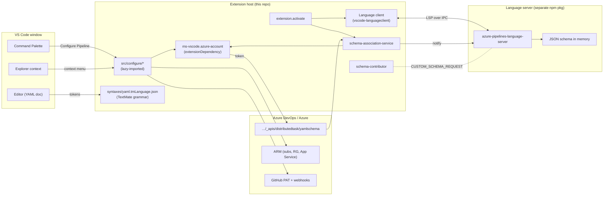
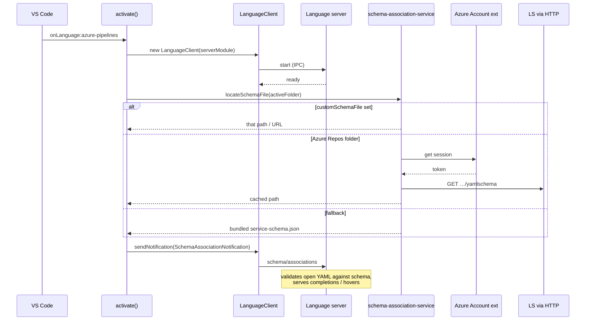
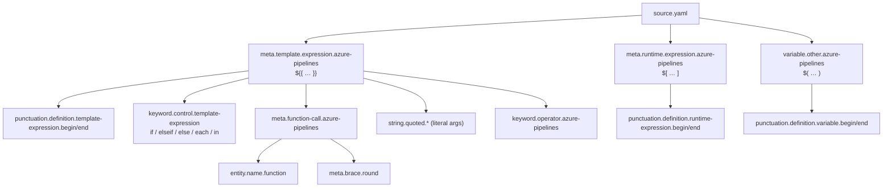
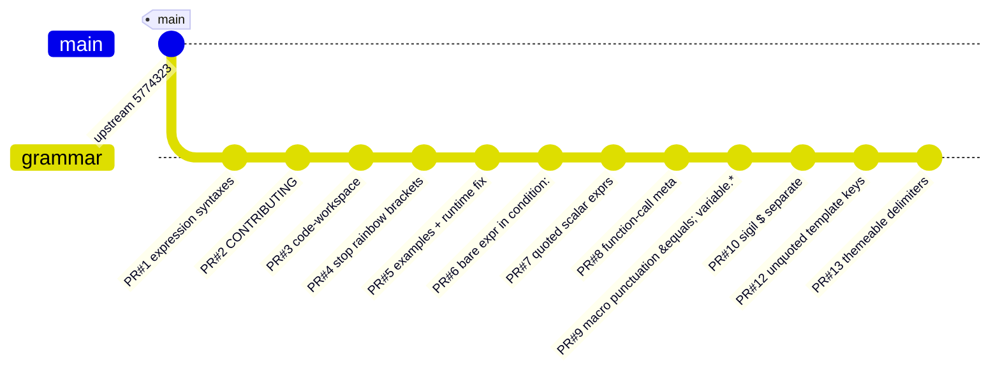
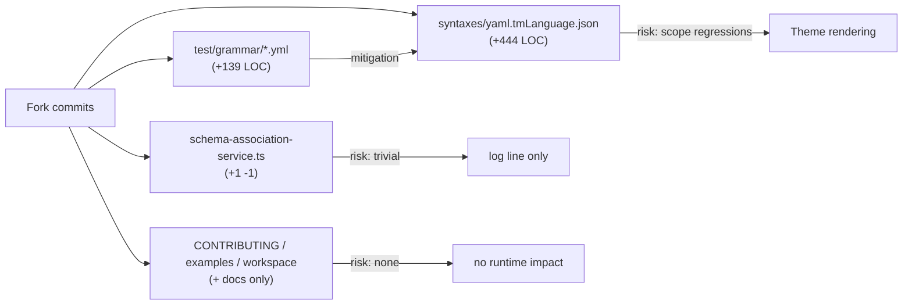
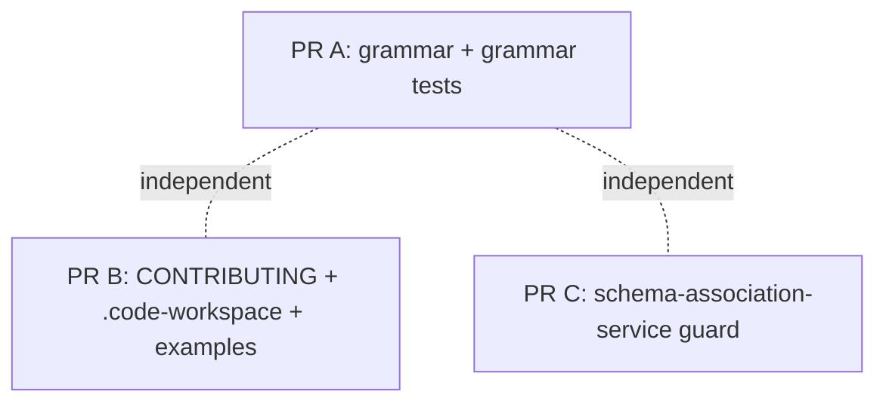
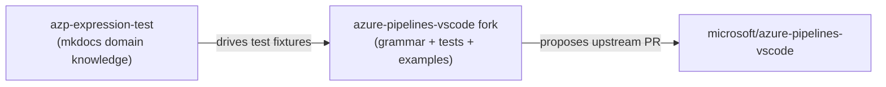

# Fork Overview — `coolhome/azure-pipelines-vscode`

A maintainer-facing tour of the `ms-azure-devops.azure-pipelines` VS Code
extension and everything this fork adds on top of `main` (last upstream
commit `5774323` — `Bump json5 from 2.2.0 to 2.2.3 (#506)`).

Audience: an upstream reviewer deciding whether the fork's commits are
worth merging.

---

## 1. The upstream extension at a glance

The Marketplace extension does three things:

1. **Language support** for `azure-pipelines` YAML — file associations,
   a TextMate grammar (`syntaxes/yaml.tmLanguage.json`), and a language
   client that talks to the
   [`azure-pipelines-language-server`](https://github.com/microsoft/azure-pipelines-language-server)
   for schema-aware validation and IntelliSense.
2. **Schema association** — picks a JSON schema (the bundled
   `service-schema.json`, an auto-detected per-organization schema fetched
   from Azure DevOps, or a user-configured `azure-pipelines.customSchemaFile`)
   and pushes it to the language server.
3. **Configure Pipeline** — a guided command (lazy-loaded from
   `src/configure/`) that scaffolds a starter YAML and wires up a CI/CD
   trigger against Azure Web Apps for a Git repo hosted on GitHub or
   Azure Repos.

### Component map



### Activation sequence



### Source layout (upstream)

| Path | Role |
| --- | --- |
| `src/extension.ts` | Entry point. Spins up language client, wires schema reload events, lazy-imports Configure Pipeline. |
| `src/schema-association-service.ts` | Picks a schema source (custom / auto-detected / bundled) and notifies the server. |
| `src/schema-contributor.ts` | API surface for other extensions to inject schema fragments. |
| `src/configure/**` | Configure Pipeline flow — Azure auth, target picking, template rendering (mustache), repo + webhook setup. |
| `src/helpers/telemetryHelper.ts` | App Insights wrapper. |
| `syntaxes/yaml.tmLanguage.json` | TextMate grammar. Tokenizes YAML *plus* Azure Pipelines expression syntaxes (this is where most of the fork's work lives). |
| `service-schema.json` | The bundled fallback YAML schema (~1 MB). |
| `language-configuration.json` | Comments, brackets, word pattern. |
| `package.json` | Contributes the `azure-pipelines` language, the `configure-pipeline` command, the explorer menu, and one config namespace. |

Notable design choices in upstream:

- The server is consumed as a **versioned npm package**
  (`azure-pipelines-language-server@0.7.0`) — schema validation logic
  lives there, not here.
- `Configure Pipeline` is **lazy-loaded** (`await import('./configure/activate')`)
  so the cold path for editing YAML doesn't pay for the Azure SDK
  dependency graph.
- Telemetry calls are wrapped in `callWithTelemetryAndErrorHandling`, so
  every top-level operation reports duration + outcome.

---

## 2. What this fork adds

42 fork commits across 13 PRs, scoped to **grammar fidelity** and
**developer experience for grammar work**, with one tiny bug fix in
`schema-association-service.ts`.

### Change summary

```
 .vscode/extensions.json                          |   4 +-
 CONTRIBUTING.md                                  |  81 ++
 azure-pipelines-vscode.code-workspace            |  71 ++
 examples/.vscode/settings.json                   |  13 +
 examples/complexTemplate.yml                     | 155 ++
 examples/expressionSyntaxes.yml                  |  49 +
 examples/templateMappingInsert.yml               |  53 +-
 language-configuration.json                      |   1 +
 package.json                                     |   6 +-
 src/schema-association-service.ts                |   2 +-
 syntaxes/yaml.tmLanguage.json                    | 450 ++++
 test/grammar/*.yml                               | 139 ++  (6 new files)
```

No runtime dependencies added; no public API or settings changed.

### Theme of the work — expression-aware highlighting

The upstream grammar inherited the stock YAML TextMate grammar, which
treats Azure Pipelines' three expression syntaxes as opaque scalar text:

| Syntax | When it resolves | Where it appears |
| --- | --- | --- |
| `${{ … }}` template expression | compile-time | anywhere YAML allows, including **keys**, **string fragments**, and conditional/iterative inserts (`${{ if … }}:`, `${{ each x in … }}:`) |
| `$( … )` macro | agent late substitution | inside task inputs / strings |
| `$[ … ]` runtime expression | server runtime | must occupy a whole scalar |

The fork teaches the grammar to recognize all three in every position
they can legally appear, and to break them into bracket / sigil /
operator / function scopes so themes can color them coherently — the
same way TS, JSON, etc. are colored.

### Scope tree the fork introduces



The key insight: **macro punctuation moved under `variable.*`** so it
inherits the variable foreground color even inside block scalars where
themes don't reach `punctuation.*`. Bracket-pair colorization (the
"rainbow brackets" feature in VS Code) is suppressed inside expressions
by keeping them inside the plain-scalar scope and adding
`meta.brace.round` for function-call parens so themes — not the rainbow
— pick the color.

### PR / commit timeline



(PR #11 was a workspace-only update folded into #10.)

### Where each PR landed

| PR | What | Files |
| --- | --- | --- |
| #1  | First pass: highlight `${{ }}`, `$[ ]`, `$( )` at all | `syntaxes/yaml.tmLanguage.json` |
| #2  | Document local dev (F5 host, `.vsix` install, grammar tests) | `CONTRIBUTING.md` |
| #3  | Multi-root `.code-workspace` for grammar + domain docs side-by-side | `azure-pipelines-vscode.code-workspace` |
| #4  | Stop bracket-pair colorization inside expressions | grammar |
| #5  | Fix runtime-expression closing bracket scope; richer examples | grammar + `examples/` |
| #6  | Highlight bare expressions in `condition:` and as mapping keys | grammar |
| #7  | Highlight expression string literals inside YAML-quoted scalars | grammar |
| #8  | Scope function-call parens as `meta.brace.round`; dotted `meta.template.expression` | grammar |
| #9  | Macro `$( )` punctuation under `variable.*` so block scalars color it | grammar |
| #10 | Color the sigil `$` separately from brackets | grammar |
| #12 | Drop `string` scope from quoted template-expression keys so `{{ }}` match unquoted | grammar |
| #13 | Theme-friendly delimiter scopes for the expression brackets | grammar |

### One non-grammar code change

`src/schema-association-service.ts:1` — guards `workspaceFolder.name`
in a fallback log path (avoids a crash when the folder is `undefined`
during the no-Azure-Repo schema-detection fallback). Two-line defensive
fix, no behavior change for the happy path.

### Test coverage added

`vscode-tmgrammar-test` was a dev-dep already; the fork adds a new
`test:grammar` script wired to it plus six fixture files that pin the
scope stack at character ranges:

```
test/grammar/
  condition-expression.yml
  macro-expression.yml
  runtime-expression.yml
  template-expression-key.yml
  template-expression-yaml-quoted.yml
  template-expression.yml
```

These run headlessly (no VS Code boot), so the grammar is now
regression-tested in CI-friendly form. `npm run test:grammar:watch`
gives sub-second feedback while iterating on patterns.

### DX additions

- `CONTRIBUTING.md` — local dev workflow, scope inspection tip,
  the four test commands.
- `azure-pipelines-vscode.code-workspace` — multi-root that bundles
  this repo with the `azp-expression-test` domain docs for cross-reading.
- `examples/.vscode/settings.json` — overrides bracket-pair colorization
  inside the examples workspace so screenshots match what real users
  see with a stock theme.
- `examples/complexTemplate.yml`, `examples/expressionSyntaxes.yml`,
  `examples/templateMappingInsert.yml` — full-fat samples exercising
  conditional and iterative insertion, all three expression syntaxes,
  and quoted-scalar template expressions.

---

## 3. Reviewer's angle — should upstream take this?

### Risk surface



- **Grammar:** the only file with meaningful risk. Mitigation: the new
  scope assertions in `test/grammar/*.yml` lock the contract in place.
  A bad change to the grammar fails the suite with a precise diff.
- **TypeScript:** one defensive null check. Trivially safe.
- **Docs / examples / workspace:** zero runtime impact, opt-in for
  contributors.

### Compatibility checklist

| Concern | Status |
| --- | --- |
| New runtime dependency? | None. |
| New settings / commands / language IDs? | None. |
| Changes to public extension API (`schema-contributor`)? | None. |
| Schema bundled file (`service-schema.json`)? | Untouched. |
| Language-server protocol surface? | Untouched. |
| Activation events / extension dependencies? | Unchanged. |
| Telemetry events? | Unchanged. |
| Marketplace metadata? | Unchanged. |
| Min VS Code engine (`^1.64.0`)? | Unchanged. |

### What a reviewer should still verify

1. **Bracket-pair colorization regression test.** PR #4 / #5 intentionally
   suppress rainbow brackets inside expressions. Confirm that *outside*
   expressions, brackets still rainbow as the user's theme configures.
   (The `examples/.vscode/settings.json` override sets the expectation
   for the examples folder only; the global default is untouched.)
2. **Stock themes.** Walk through the `examples/expressionSyntaxes.yml`
   file with Dark+ / Light+ / Solarized Dark to confirm no
   readability regressions. The grammar uses `meta.brace.round`,
   `variable.other`, `punctuation.definition.variable.*`, and
   `keyword.operator.azure-pipelines` — all are existing scopes that
   built-in themes already color.
3. **Run `npm run test:grammar` in CI.** The script exists but isn't
   wired into the upstream Azure Pipelines build definition yet —
   adding it is one line in `.azure-pipelines/`.
4. **`schema-association-service.ts` log guard.** Confirm the
   `workspaceFolder` can in fact be `undefined` on the fallback path
   (it can — the multi-workspace + no-active-editor case).

### Suggested split for upstream merge

If a single PR feels too large, the work splits cleanly along a fault
line:



PR A is the bulk of the value and the only change with surface area;
PR B and PR C are no-risk pickups upstream can take whenever.

---

## 4. Companion project — `azp-expression-test`

This fork sits alongside `coolhome/azp-expression-test`, a docs-only
repo that captures the domain knowledge driving the grammar work:
the canonical reference for the three evaluation tiers, expression
functions, predefined variables, templates, pipeline resources, and
service connections. It's published as an mkdocs site and is the
source the grammar test fixtures were derived from.



The companion repo isn't part of any merge proposal — it's referenced
here so a reviewer chasing "why is this scope structured this way?"
has the authoritative answer one click away.
