# YAML tmLanguage Visualization

This document visualizes `syntaxes/yaml.tmLanguage.json` with a focus on parse flow and Azure Pipelines expression extensions.

## 1) Top-level Grammar Flow

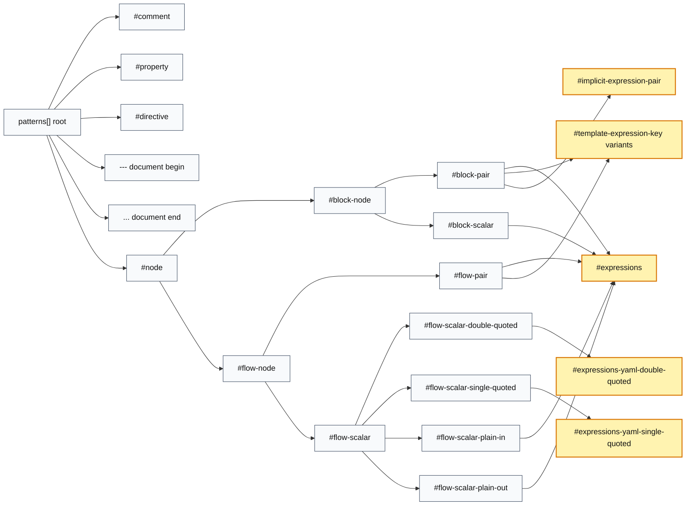

> Yellow nodes are added by this fork (not present in the upstream VS Code YAML grammar).

## 2) Azure Pipelines Expression Subsystem

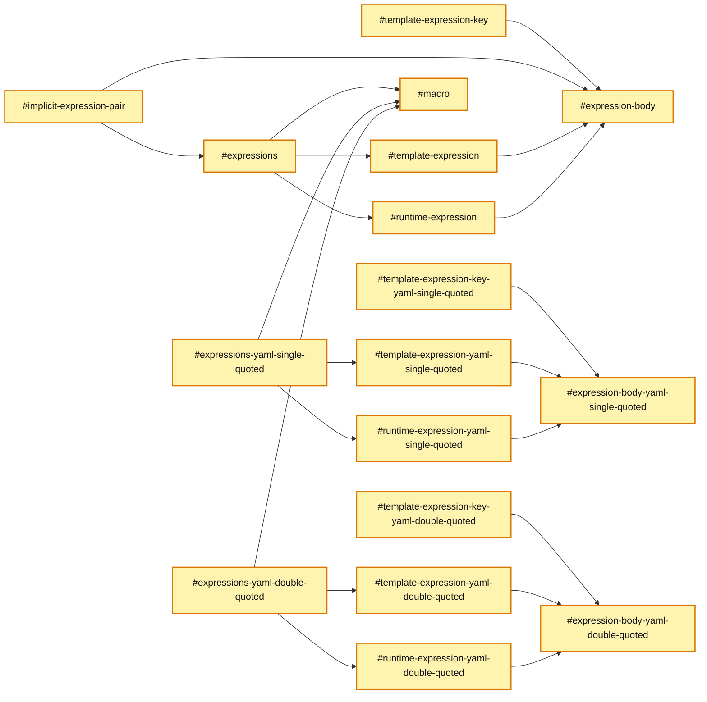

> Every node in this diagram is fork-added (the entire Azure expression subsystem).

## 3) Expression Body Building Blocks

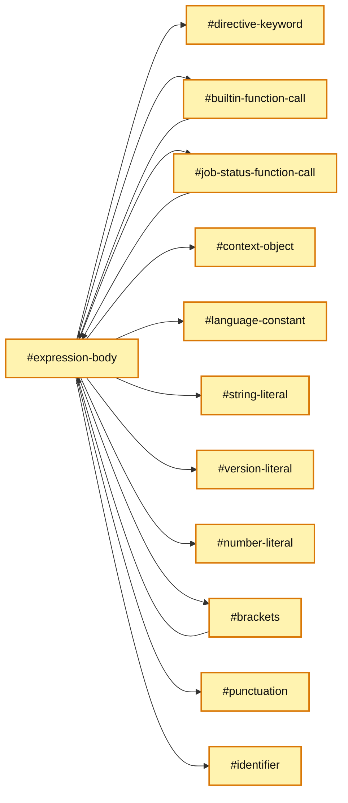

> Every node in this diagram is fork-added.

## 4) Top-level Grammar, Grouped

Same content as diagram 1, but with subgraph "boxes" that encapsulate logical groups.
    direction LR

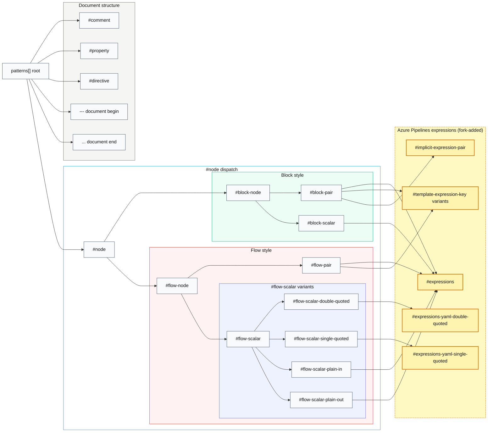

## 5) How Things Break Down — Visual Examples

Concrete YAML snippets shown the way VS Code actually parses them: each row is one token span with its full scope stack (matches the output of `Developer: Inspect Editor Tokens and Scopes`), followed by a push/pop stack timeline.

### 5.1 `value: ${{ parameters.image }}`

```yaml
value: ${{ parameters.image }}
```

**Annotated source (one row per token span):**

| Pos | Text | Scope stack (top-most last) |
|----:|------|-----------------------------|
| 0–4 | `value` | `source.yaml` → `entity.name.tag.yaml` |
| 5 | `:` | `source.yaml` → `punctuation.separator.key-value.mapping.yaml` |
| 7 | `$` | `source.yaml` → `meta.template.expression.azure-pipelines` → `keyword.operator.expression.sigil.azure-pipelines` |
| 8–9 | `{{` | … → `punctuation.definition.template-expression.begin.azure-pipelines` |
| 10 | ` ` | … → `meta.template.expression.body.azure-pipelines` |
| 11–20 | `parameters` | … → `variable.other.identifier.azure-pipelines` |
| 21 | `.` | … → `punctuation.accessor.azure-pipelines` |
| 22–26 | `image` | … → `variable.other.identifier.azure-pipelines` |
| 27 | ` ` | … → `meta.template.expression.body.azure-pipelines` |
| 28–29 | `}}` | … → `punctuation.definition.template-expression.end.azure-pipelines` |

**Stack timeline (push = →, pop = ←):**

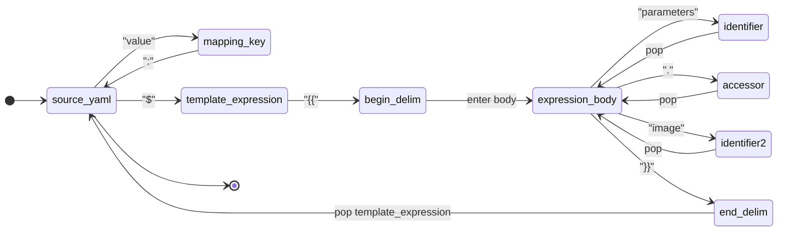

### 5.2 `condition: $[ and(succeeded(), eq(variables.flag, 'yes')) ]`

```yaml
condition: $[ and(succeeded(), eq(variables.flag, 'yes')) ]
```

**Annotated source:**

| Pos | Text | Scope stack |
|----:|------|-------------|
| 0–8 | `condition` | `source.yaml` → `entity.name.tag.yaml` |
| 9 | `:` | … → `punctuation.separator.key-value.mapping.yaml` |
| 11 | `$` | … → `meta.runtime-expression.azure-pipelines` → `keyword.operator.expression.sigil` |
| 12 | `[` | … → `punctuation.definition.runtime-expression.begin` |
| 14–16 | `and` | … → `expression-body` → `meta.function-call.builtin.azure-pipelines` → `support.function` |
| 17 | `(` | … → `meta.brace.round` |
| 18–26 | `succeeded` | … → inner `meta.function-call.builtin` → `support.function` |
| 27 | `(` | … → inner `meta.brace.round` |
| 28 | `)` | … → close inner call, pop to outer `and()` body |
| 28 | `,` | … → `punctuation.separator.comma` |
| 30–31 | `eq` | … → another `meta.function-call.builtin` → `support.function` |
| 32 | `(` | … → `meta.brace.round` |
| 33–46 | `variables.flag` | … → identifier + accessor + identifier |
| 46 | `,` | … → `punctuation.separator.comma` |
| 48 | `'` | … → `string.quoted.single.azure-pipelines` → `punctuation.definition.string.begin` |
| 49–51 | `yes` | … → string content |
| 52 | `'` | … → `punctuation.definition.string.end` (pop string) |
| 53 | `)` | … → close `eq()` |
| 54 | `)` | … → close `and()` |
| 56 | `]` | … → `punctuation.definition.runtime-expression.end` (pop runtime-expression) |

**Stack depth over the line:**

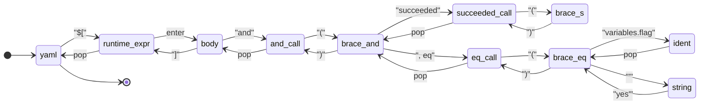

### 5.3 `script: "echo Hello $(Build.BuildId) from $(Agent.Name)"`

```yaml
script: "echo Hello $(Build.BuildId) from $(Agent.Name)"
```

**Annotated source:**

| Pos | Text | Scope stack |
|----:|------|-------------|
| 0–5 | `script` | `source.yaml` → `entity.name.tag.yaml` |
| 6 | `:` | … → `punctuation.separator.key-value.mapping.yaml` |
| 8 | `"` | … → `string.quoted.double.yaml` → `punctuation.definition.string.begin.yaml` |
| 9–19 | `echo Hello ` | … → `string.quoted.double.yaml` |
| 20 | `$` | … → `variable.other.readwrite.azure-pipelines` → `punctuation.definition.variable.azure-pipelines` |
| 21 | `(` | … → `punctuation.definition.variable.azure-pipelines` |
| 22–33 | `Build.BuildId` | … → `variable.other.readwrite.azure-pipelines` |
| 34 | `)` | … → `punctuation.definition.variable.azure-pipelines` (pop macro) |
| 35–40 | ` from ` | … → `string.quoted.double.yaml` |
| 41–54 | `$(Agent.Name)` | … → second `variable.other.readwrite.azure-pipelines` push/pop |
| 55 | `"` | … → `punctuation.definition.string.end.yaml` (pop string) |

**Stack timeline:**

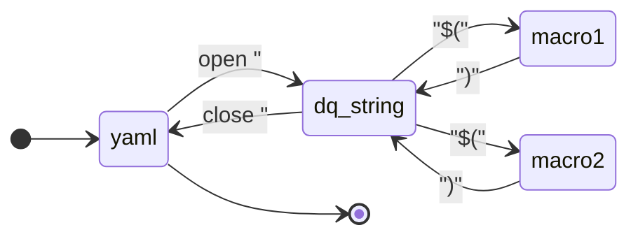

Key insight: the `string.quoted.double.yaml` scope stays on the stack across both `$( ... )` macros — they push a *sibling* scope on top, render, and pop back into the string. That's why the macros highlight uniformly inside quoted *and* plain scalars.

### 5.4 `${{ if eq(parameters.os, 'linux') }}:` as a mapping key

```yaml
${{ if eq(parameters.os, 'linux') }}:
  image: ubuntu-latest
```

**Annotated source:**

| Pos | Text | Scope stack |
|----:|------|-------------|
| 0 | `$` | `source.yaml` → `meta.template.expression.azure-pipelines` → `keyword.operator.expression.sigil` |
| 1–2 | `{{` | … → `punctuation.definition.template-expression.begin` |
| 4–5 | `if` | … → `expression-body` → `keyword.control.directive.azure-pipelines` |
| 7–8 | `eq` | … → `meta.function-call.builtin` → `support.function` |
| 9 | `(` | … → `meta.brace.round` |
| 10–22 | `parameters.os` | … → identifier + accessor |
| 22 | `,` | … → `punctuation.separator.comma` |
| 24 | `'` | … → `string.quoted.single.azure-pipelines` |
| 25–29 | `linux` | … → string content |
| 30 | `'` | … → pop string |
| 31 | `)` | … → pop `eq()` |
| 33–34 | `}}` | … → `punctuation.definition.template-expression.end` (pop template-expression) |
| 35 | `:` | `source.yaml` → `punctuation.separator.key-value.mapping.yaml` |

**Stack timeline:**

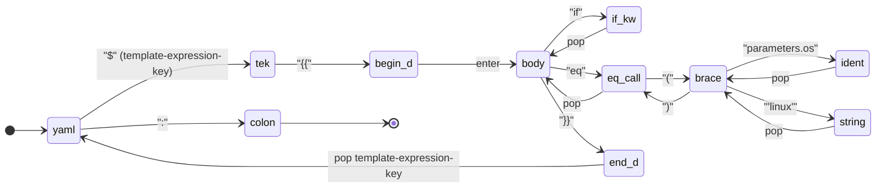

The whole `${{ ... }}` lives at the *key* position, so when it pops, the parser is back at `source.yaml` ready to consume the `:` — not inside any scalar scope. That's exactly the bug fixed in 6.2.

### How to verify these traces against real output

1. Open one of the YAML snippets in VS Code with this extension active.
2. `Ctrl+Shift+P` → **Developer: Inspect Editor Tokens and Scopes**.
3. Click any character in the editor; the popup shows the live scope stack.
4. Compare row-by-row with the tables above.

That tool is the ground truth — if a table here disagrees, the table is wrong (and probably worth a commit to fix).


## 6) Tricky Challenges & How We Resolved Them

Each subsection summarizes a real problem from this fork's history, the symptom in the editor, why it happened, the fix, and a before/after parse view.

---

### 6.1 Macro embedded in a plain scalar collapsed the rest of the line

**Symptom:** `$(Build.BuildId)` inside an unquoted scalar like `name: build-$(Build.BuildId)-final` was swallowed by the plain-scalar regex, so the macro and trailing text rendered as one undifferentiated string.

**Why:** YAML's `flow-scalar-plain-*` pattern is greedy — once it starts matching, it owns the line until end-of-scalar. Macro highlighting never got a chance to fire.

**Fix:** End the plain scalar at expression sigils (`$`) and re-enter via `#expressions`. See commit `1c8b19c` ("End plain scalar before expression sigils so embedded macros render uniformly").

Input: `name: build-$(Build.BuildId)-final`

**Before — one greedy scalar swallows everything:**

| Pos | Text | Scope stack |
|----:|------|-------------|
| 0–3 | `name` | `source.yaml` → `entity.name.tag.yaml` |
| 4 | `:` | … → `punctuation.separator.key-value.mapping.yaml` |
| 6–34 | `build-$(Build.BuildId)-final` | … → `string.unquoted.plain.out.yaml` (single span) |

**After — scalar yields to `#macro` at `$`:**

| Pos | Text | Scope stack |
|----:|------|-------------|
| 0–3 | `name` | `source.yaml` → `entity.name.tag.yaml` |
| 4 | `:` | … → `punctuation.separator.key-value.mapping.yaml` |
| 6–11 | `build-` | … → `string.unquoted.plain.out.yaml` (ends at `$`) |
| 12 | `$` | … → `variable.other.readwrite.azure-pipelines` → `punctuation.definition.variable` |
| 13 | `(` | … → `punctuation.definition.variable` |
| 14–26 | `Build.BuildId` | … → `variable.other.readwrite.azure-pipelines` |
| 27 | `)` | … → `punctuation.definition.variable` (pop macro) |
| 28–33 | `-final` | … → `string.unquoted.plain.out.yaml` (re-enters) |

**Stack timeline — Before (one flat span):**

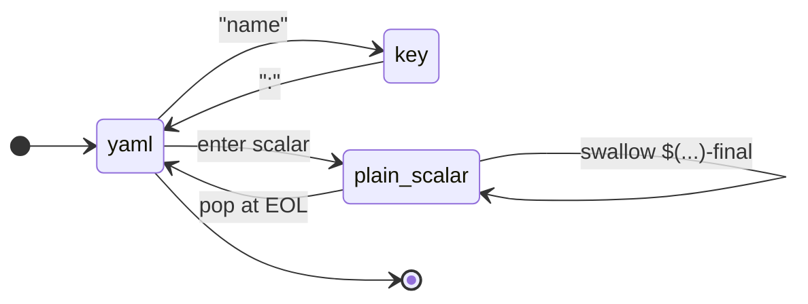

**Stack timeline — After (scalar yields, macro pushes, scalar re-enters):**

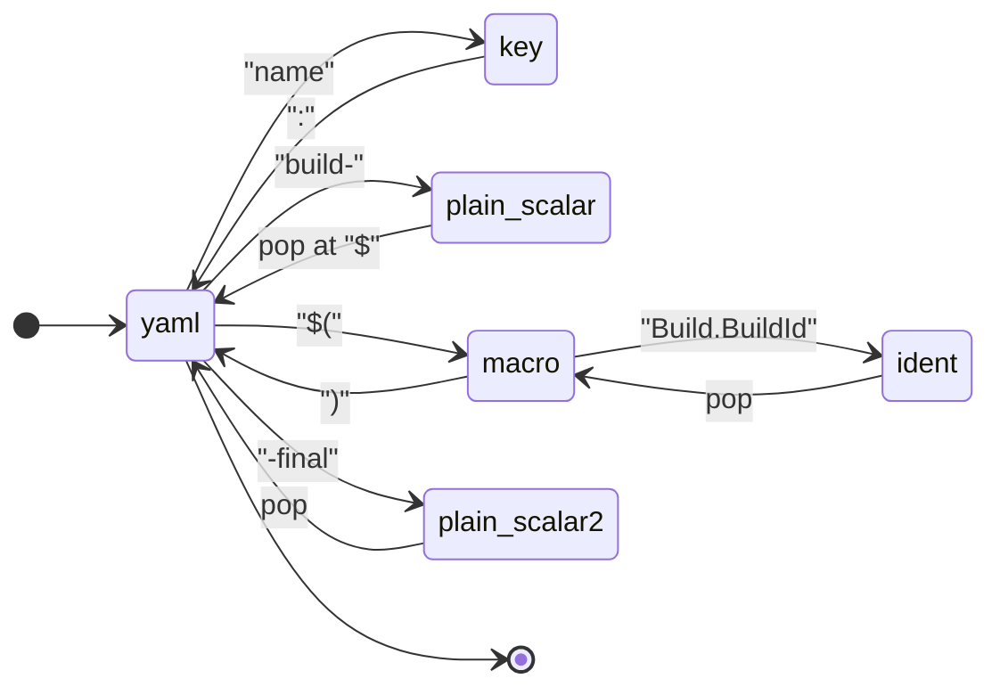

---

### 6.2 Template-expression as mapping key wasn't matched

**Symptom:** `${{ if eq(...) }}:` keys were not highlighted as expressions; they were treated as a quoted-looking plain string.

**Why:** `#template-expression` only matches inside scalar *values*. Mapping keys are parsed by `#block-pair` / `#flow-pair` before scalar dispatch, so the expression never reached `#expressions`.

**Fix:** Introduce dedicated `#template-expression-key` variants (plain, single-quoted, double-quoted) and include them at the start of `#block-pair` and `#flow-pair`. See `591b18a` ("Highlight bare expressions in condition: and template expressions used as mapping keys").

Input: `${{ if eq(parameters.os, 'linux') }}: ubuntu-latest`

**Before — key is treated as a generic plain scalar:**

| Pos | Text | Scope stack |
|----:|------|-------------|
| 0–34 | `${{ if eq(parameters.os, 'linux') }}` | `source.yaml` → `string.unquoted.plain.out.yaml` (one span, no expression scope) |
| 35 | `:` | … → `punctuation.separator.key-value.mapping.yaml` |
| 37–49 | `ubuntu-latest` | … → `string.unquoted.plain.out.yaml` |

**After — key matches `#template-expression-key` *before* scalar parsing:**

| Pos | Text | Scope stack |
|----:|------|-------------|
| 0 | `$` | `source.yaml` → `meta.template.expression.azure-pipelines` → `keyword.operator.expression.sigil` |
| 1–2 | `{{` | … → `punctuation.definition.template-expression.begin` |
| 4–5 | `if` | … → `expression-body` → `keyword.control.directive.azure-pipelines` |
| 7–35 | `eq(parameters.os, 'linux')` | … → recursive function-call body (see 5b.4 for detail) |
| 36–37 | `}}` | … → `punctuation.definition.template-expression.end` (pop) |
| 38 | `:` | `source.yaml` → `punctuation.separator.key-value.mapping.yaml` |
| 40–52 | `ubuntu-latest` | … → `string.unquoted.plain.out.yaml` |

**Stack timeline — Before (key falls through to plain scalar):**

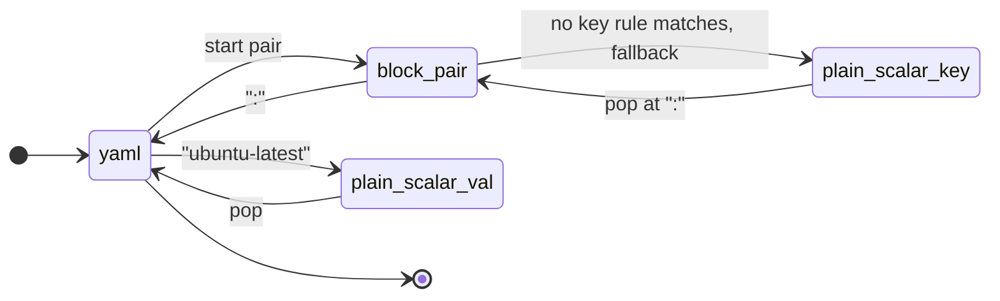

**Stack timeline — After (`#template-expression-key` wins before scalar dispatch):**

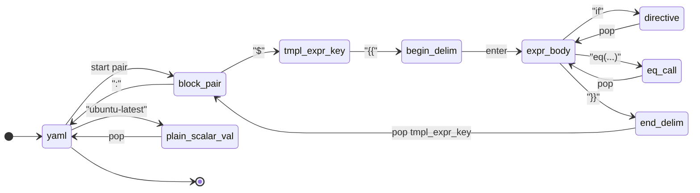

---

### 6.3 String literals inside expressions inside quoted scalars

**Symptom:** `"${{ eq(parameters.os, 'linux') }}"` rendered `'linux'` as raw text, breaking the visual cue that it was a string argument.

**Why:** Inside a YAML double-quoted scalar, an embedded expression body re-tokenized with the *outer* string scope still active. The inner `'linux'` ran into single-quote parsing conflicts.

**Fix:** Mirror `#expression-body` into `-yaml-single-quoted` and `-yaml-double-quoted` variants with quote-aware `#string-literal-*` children. See `3da5b3c`.

Input: `"${{ eq(parameters.os, 'linux') }}"`

**Before — outer string scope leaks into the inner `'linux'`:**

| Pos | Text | Scope stack |
|----:|------|-------------|
| 0 | `"` | `source.yaml` → `string.quoted.double.yaml` → `punctuation.definition.string.begin` |
| 1 | `$` | … → `meta.template.expression` → `sigil` (but **still inside `string.quoted.double.yaml`**) |
| 2–3 | `{{` | … → `punctuation.definition.template-expression.begin` |
| 5–17 | `eq(parameters.os,` | … → expression-body using base `#string-literal` rules |
| 19 | `'` | **mismatch**: tries to *close* the outer string scope, leaves `linux'` un-scoped |
| 20–24 | `linux` | scope stack is now broken — falls back to bare `source.yaml` |

**After — `-yaml-double-quoted` variants own the inner string:**

| Pos | Text | Scope stack |
|----:|------|-------------|
| 0 | `"` | `source.yaml` → `string.quoted.double.yaml` → `punctuation.definition.string.begin` |
| 1 | `$` | … → `meta.template.expression.azure-pipelines` → `sigil` |
| 2–3 | `{{` | … → `punctuation.definition.template-expression.begin` |
| 5–6 | `eq` | … → `expression-body-yaml-double-quoted` → `support.function` |
| 7 | `(` | … → `meta.brace.round` |
| 8–20 | `parameters.os` | … → identifier + accessor |
| 22 | `'` | … → `string-literal-yaml-double-quoted` → `punctuation.definition.string.begin` |
| 23–27 | `linux` | … → string content (inner scope, doesn't pop the outer `"`) |
| 28 | `'` | … → pop inner string |
| 29 | `)` | … → close `eq()` |
| 31–32 | `}}` | … → `punctuation.definition.template-expression.end` |
| 33 | `"` | … → `punctuation.definition.string.end` (pop outer string) |

**Stack timeline — Before (inner `'` is mistaken for the outer `"` close):**

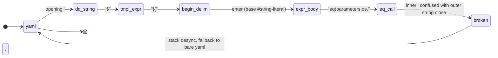

**Stack timeline — After (quote-aware variants keep the stack consistent):**

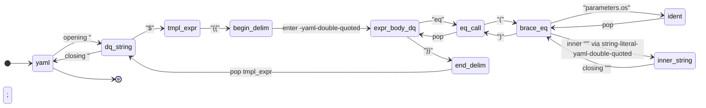

The trick: every variant (`-yaml-single-quoted` / `-yaml-double-quoted`) is a near-copy of the base, swapping only the quote rules so the language server stays in a consistent quote context.

---

### 6.4 Bracket "rainbow" stole color from expression delimiters

**Symptom:** With VS Code's bracket pair colorization on, the `{{`, `}}`, `(`, `)`, `[`, `]` inside expressions cycled through rainbow colors that visually competed with theme keyword colors.

**Why:** Default bracket scopes triggered bracket pair colorization; the `$` sigil shared the same scope so it inherited the same shifting color.

**Fix (multi-commit):**
- `385bbbf`: keep template expressions *inside* the plain scalar wrapper so brackets aren't seen as top-level pairs.
- `db21035`: split sigil scope from bracket scope so `$` colors independently from `{{ }}` / `( )` / `[ ]`.
- `5af7293` (current head): assign theme-friendly scopes (`keyword.other.template-expression`, `keyword.operator.expression.sigil`, `punctuation.definition.variable`) so each delimiter family is themed by token color, not bracket rainbow.

Input: `${{ x }}` (just the delimiters of interest)

**Before — sigil and delimiters share one bracket-ish scope:**

| Pos | Text | Scope stack |
|----:|------|-------------|
| 0 | `$` | `source.yaml` → `meta.template.expression` → `punctuation.section.braces.begin` |
| 1–2 | `{{` | … → `punctuation.section.braces.begin` (same scope as `$` → bracket pair colorization fires across both) |
| 4 | `x` | … → `expression-body` → `identifier` |
| 6–7 | `}}` | … → `punctuation.section.braces.end` |

**After — three distinct, theme-friendly scopes:**

| Pos | Text | Scope stack |
|----:|------|-------------|
| 0 | `$` | `source.yaml` → `meta.template.expression.azure-pipelines` → `keyword.operator.expression.sigil.azure-pipelines` |
| 1–2 | `{{` | … → `keyword.other.template-expression.azure-pipelines` + `punctuation.definition.template-expression.begin.azure-pipelines` |
| 4 | `x` | … → `meta.template.expression.body.azure-pipelines` → `variable.other.identifier` |
| 6–7 | `}}` | … → `keyword.other.template-expression.azure-pipelines` + `punctuation.definition.template-expression.end.azure-pipelines` |

**Stack timeline — Before (`$` and `{{` share one bracket scope):**

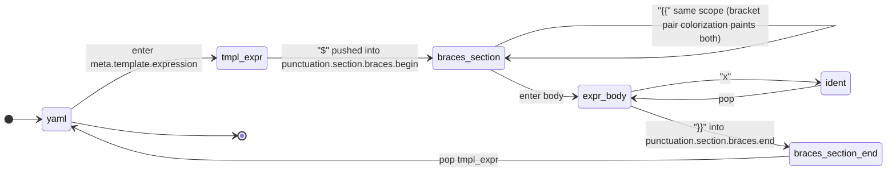

**Stack timeline — After (three distinct scope families, no bracket-pair confusion):**

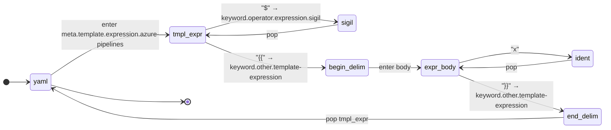

Why this matters: the `$` and `{{` no longer share a `punctuation.section.braces.*` scope, so VS Code's bracket-pair colorization doesn't see the expression delimiters as a *bracket* pair — and themes color them via the `keyword.*` tokens instead.

---

### 6.5 Quoted template key dragged "string" theming inside

**Symptom:** `'${{ parameters.x }}'` keys took on the string theme color, so `{{ }}` looked like part of a string literal instead of an expression boundary.

**Why:** The outer `'...'` opened a `string.quoted.single.yaml` scope that nested over the inner expression captures.

**Fix:** In `#template-expression-key-yaml-*-quoted`, scope the outer `'`/`"` as plain `punctuation.definition.string.*` only — drop the broad `string.quoted.*` envelope. See `5d6291a` ("Drop string scope from quoted template-expression keys so {{ }} match unquoted theming") and `c29d2a7` (related stray-quote fix).

Input: `'${{ parameters.x }}':`

**Before — `string.quoted.single.yaml` wraps everything, so the body inherits string color:**

| Pos | Text | Scope stack |
|----:|------|-------------|
| 0 | `'` | `source.yaml` → `string.quoted.single.yaml` → `punctuation.definition.string.begin` |
| 1 | `$` | … → `string.quoted.single.yaml` → `meta.template.expression` → `sigil` (still under `string.*`) |
| 2–3 | `{{` | … → `string.quoted.single.yaml` → `keyword.other.template-expression` (themed as string!) |
| 5–16 | `parameters.x` | … → `string.quoted.single.yaml` → expression body (themed as string!) |
| 18–19 | `}}` | … → `string.quoted.single.yaml` → `keyword.other.template-expression` |
| 20 | `'` | … → `punctuation.definition.string.end` (pop) |
| 21 | `:` | `source.yaml` → `punctuation.separator.key-value.mapping.yaml` |

**After — only the quotes themselves carry string scope:**

| Pos | Text | Scope stack |
|----:|------|-------------|
| 0 | `'` | `source.yaml` → `meta.template.expression.azure-pipelines` → `punctuation.definition.string.begin.yaml` |
| 1 | `$` | … → `keyword.operator.expression.sigil.azure-pipelines` (no `string.*` on stack) |
| 2–3 | `{{` | … → `keyword.other.template-expression.azure-pipelines` |
| 5–16 | `parameters.x` | … → `expression-body-yaml-single-quoted` → identifier + accessor |
| 18–19 | `}}` | … → `keyword.other.template-expression.azure-pipelines` |
| 20 | `'` | … → `punctuation.definition.string.end.yaml` (pop template-expression-key) |
| 21 | `:` | `source.yaml` → `punctuation.separator.key-value.mapping.yaml` |

**Stack timeline — Before (`string.quoted.single.yaml` envelopes the whole key):**

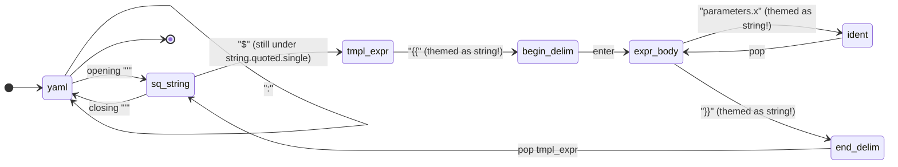

**Stack timeline — After (only the quote tokens carry string scope):**

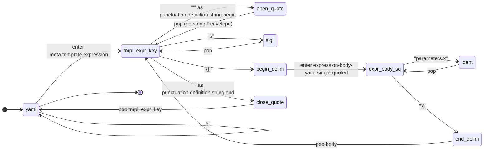

Key difference: in the *After* stack, no row contains `string.quoted.single.yaml`. Themes that color `string.*` no longer paint the expression body.

---

### 6.6 Runtime expression `]` closed at the wrong scope

**Symptom:** The closing `]` of `$[ ... ]` did not get the same scope as the opening `[`, so themes couldn't pair them.

**Why:** The end-capture used a slightly different scope name than the begin-capture.

**Fix:** Single-line scope alignment in `e35e27c` ("Fix runtime-expression closing bracket scope"). Visually, both delimiters now share `punctuation.definition.runtime-expression.*.azure-pipelines` and pair correctly.

Input: `$[ x ]`

**Before — open and close bracket scopes don't match:**

| Pos | Text | Scope stack |
|----:|------|-------------|
| 0 | `$` | `source.yaml` → `meta.runtime-expression` → `sigil` |
| 1 | `[` | … → `punctuation.definition.runtime-expression.begin.azure-pipelines` |
| 3 | `x` | … → `expression-body` → `identifier` |
| 5 | `]` | … → `punctuation.section.brackets.end` ← **different namespace, themes can't pair it** |

**After — symmetric begin/end scopes:**

| Pos | Text | Scope stack |
|----:|------|-------------|
| 0 | `$` | `source.yaml` → `meta.runtime-expression.azure-pipelines` → `sigil` |
| 1 | `[` | … → `punctuation.definition.runtime-expression.begin.azure-pipelines` |
| 3 | `x` | … → `expression-body` → `identifier` |
| 5 | `]` | … → `punctuation.definition.runtime-expression.end.azure-pipelines` ← **matches the `.begin.`** |

**Stack timeline — Before (open and close pop into different namespaces):**

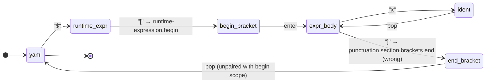

**Stack timeline — After (symmetric begin/end scopes pair cleanly):**

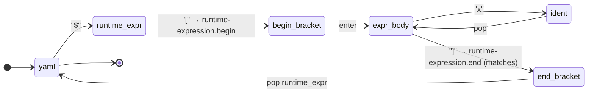

---

### 6.7 Recursion: function calls and brackets re-enter `#expression-body`

Not a "bug" but a deliberate design challenge — Azure Pipelines expressions are nestable (`and(eq(x, succeeded()), startsWith(...))`). Every grouping construct must recurse back into the body grammar without infinite-loop matching empty input.

**Resolution:** `#brackets`, `#builtin-function-call`, `#job-status-function-call` each define a begin/end pair that contains `{ "include": "#expression-body" }`. The base case is a token-level child (`#identifier`, `#literal*`) that consumes at least one character, preventing infinite recursion.

```mermaid
flowchart LR
    EB["#expression-body"] --> FN["#builtin-function-call"]
    EB --> BR["#brackets"]
    EB --> JS["#job-status-function-call"]
    EB --> ID["#identifier"]
    EB --> LIT["#string-literal / #number-literal / #version-literal / #language-constant"]
    FN -.recurse.-> EB
    BR -.recurse.-> EB
    JS -.recurse.-> EB

    classDef anchor fill:#fff3b0,stroke:#d97706,stroke-width:2px,color:#111;
    classDef recurse fill:#dbeafe,stroke:#1d4ed8,color:#111;
    classDef base    fill:#dcfce7,stroke:#15803d,color:#111;
    class EB anchor;
    class FN,BR,JS recurse;
    class ID,LIT base;
```

The dashed arrows are the recursion edges; the solid arrows down to `#identifier` and the literal nodes are the terminal cases that always make progress.

## 7) Quick Notes

- Repository size (current file): 61 repository entries, 116 include edges.
- The Azure extension is layered into normal YAML scalar and pair parsing, then dispatches into expression variants.
- Single- and double-quoted expression bodies are mirrored variants of the same core expression language.

## 8) Other Visualization Options

- VS Code: open this Markdown preview to get Mermaid rendering directly.
- Graphviz export: generate DOT from the include graph for a full repository-level dependency map.
- Interactive explorer idea: add a tiny script that emits filtered subgraphs (for example, only nodes reachable from `#flow-node` or `#expressions`).
