# YAML tmLanguage Visualization

This document visualizes `syntaxes/yaml.tmLanguage.json` with a focus on parse flow and Azure Pipelines expression extensions.

## 1) Top-level Grammar Flow

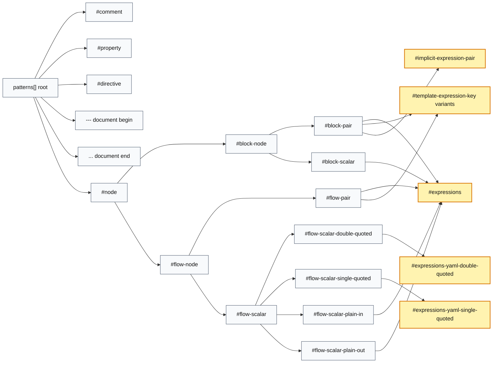

> Yellow nodes are added by this fork (not present in the upstream VS Code YAML grammar).

## 2) Azure Pipelines Expression Subsystem

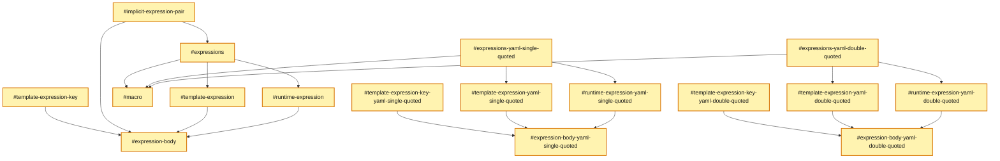

> Every node in this diagram is fork-added (the entire Azure expression subsystem).

## 3) Expression Body Building Blocks

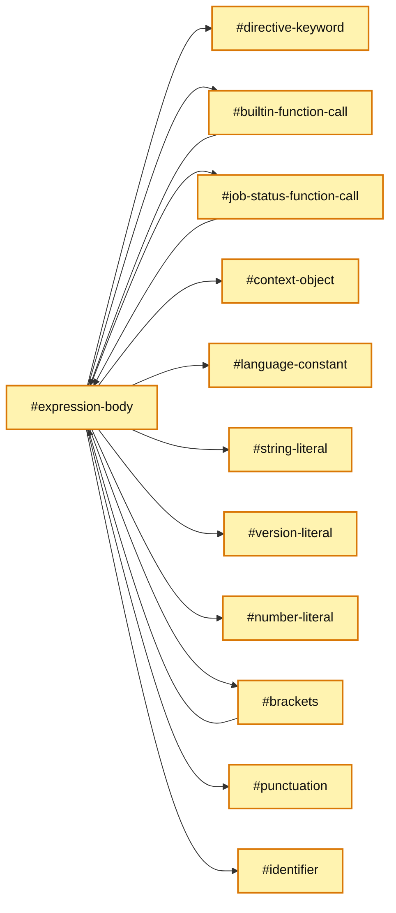

> Every node in this diagram is fork-added.

## 4) Top-level Grammar, Grouped

Same content as diagram 1, but with subgraph "boxes" that encapsulate logical groups.

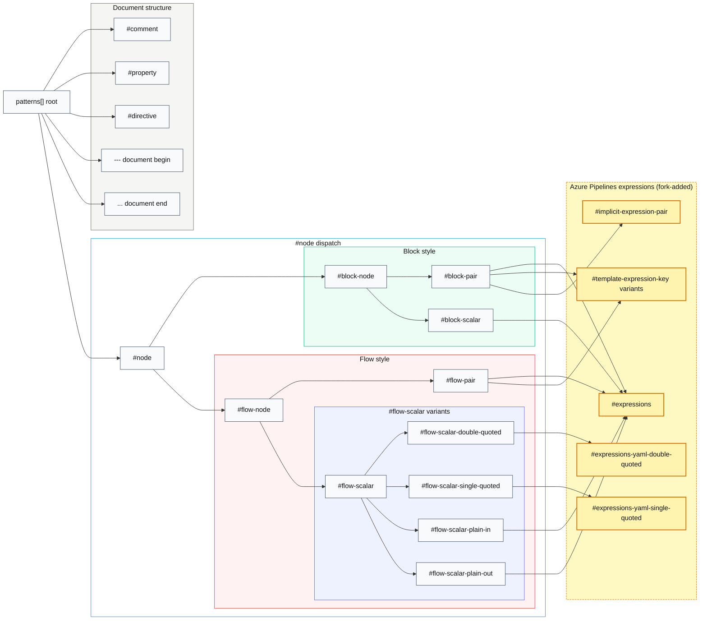

## 5) How Things Break Down — Visual Examples

Concrete YAML snippets and which grammar nodes match each part.

### 5.1 Template expression in a plain scalar

```yaml
value: ${{ parameters.image }}
```

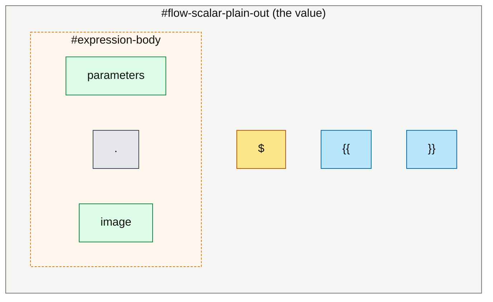

Mapping: `${{ ... }}` is matched by `#template-expression`; the inside dispatches to `#expression-body`, which here picks `#identifier` + `#punctuation`.

### 5.2 Runtime expression with a function call

```yaml
condition: $[ and(succeeded(), eq(variables.flag, 'yes')) ]
```

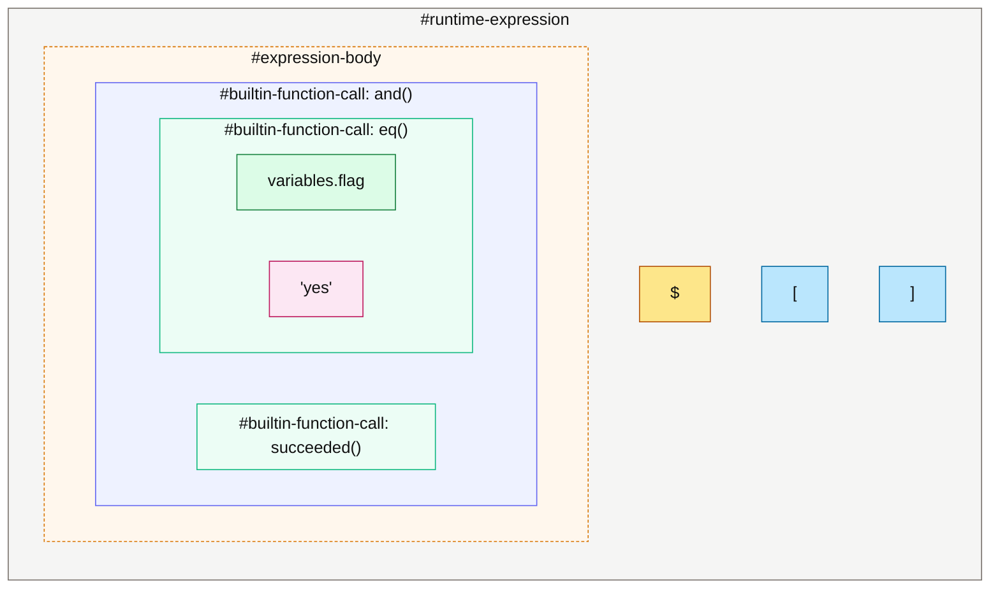

Mapping: `$[ ... ]` → `#runtime-expression` → recursive `#expression-body` → nested `#builtin-function-call` → `#brackets` and `#string-literal`.

### 5.3 Macro inside a double-quoted scalar

```yaml
script: "echo Hello $(Build.BuildId) from $(Agent.Name)"
```

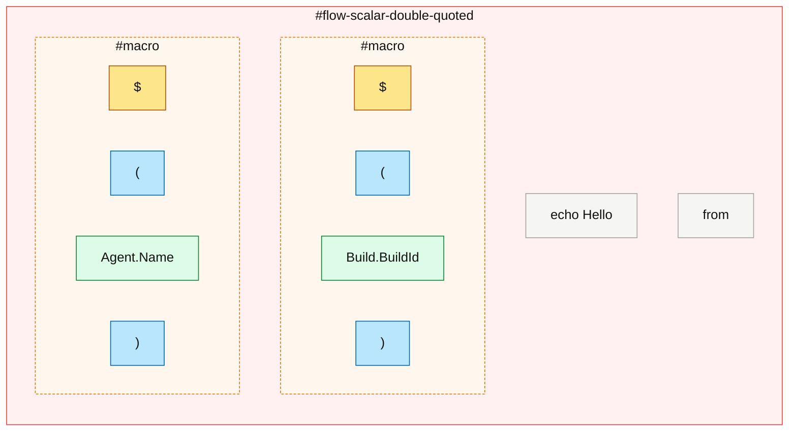

Mapping: double-quoted scalar enters `#expressions-yaml-double-quoted`; each `$( ... )` is matched by `#macro` regardless of quoting context.

### 5.4 Template expression used as a mapping key

```yaml
${{ if eq(parameters.os, 'linux') }}:
  image: ubuntu-latest
```

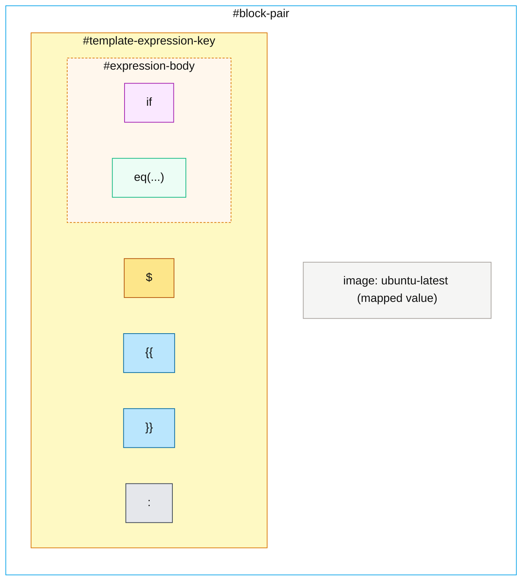

Mapping: when a `${{ }}` form sits on the left of `:`, it is matched by `#template-expression-key` (not `#template-expression`) and the inside uses `#directive-keyword` + `#builtin-function-call`.

## 6) Tricky Challenges & How We Resolved Them

Each subsection summarizes a real problem from this fork's history, the symptom in the editor, why it happened, the fix, and a before/after parse view.

---

### 6.1 Macro embedded in a plain scalar collapsed the rest of the line

**Symptom:** `$(Build.BuildId)` inside an unquoted scalar like `name: build-$(Build.BuildId)-final` was swallowed by the plain-scalar regex, so the macro and trailing text rendered as one undifferentiated string.

**Why:** YAML's `flow-scalar-plain-*` pattern is greedy — once it starts matching, it owns the line until end-of-scalar. Macro highlighting never got a chance to fire.

**Fix:** End the plain scalar at expression sigils (`$`) and re-enter via `#expressions`. See commit `1c8b19c` ("End plain scalar before expression sigils so embedded macros render uniformly").

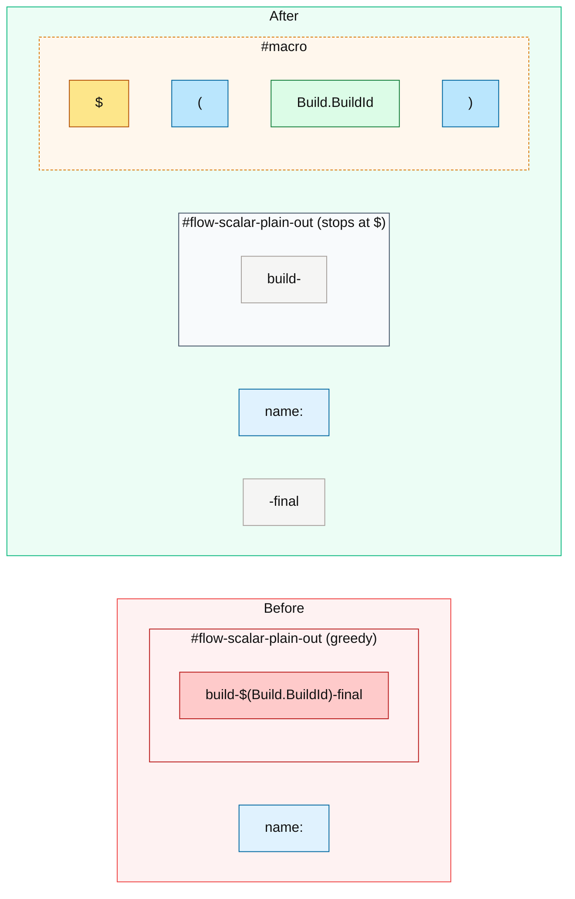

---

### 6.2 Template-expression as mapping key wasn't matched

**Symptom:** `${{ if eq(...) }}:` keys were not highlighted as expressions; they were treated as a quoted-looking plain string.

**Why:** `#template-expression` only matches inside scalar *values*. Mapping keys are parsed by `#block-pair` / `#flow-pair` before scalar dispatch, so the expression never reached `#expressions`.

**Fix:** Introduce dedicated `#template-expression-key` variants (plain, single-quoted, double-quoted) and include them at the start of `#block-pair` and `#flow-pair`. See `591b18a` ("Highlight bare expressions in condition: and template expressions used as mapping keys").

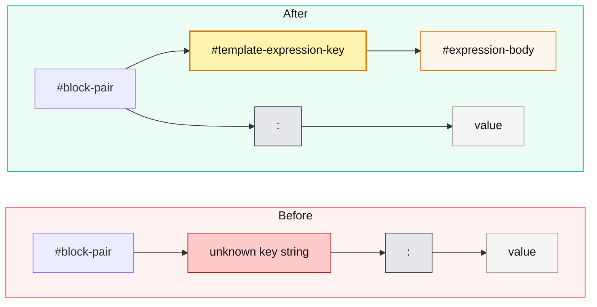

---

### 6.3 String literals inside expressions inside quoted scalars

**Symptom:** `"${{ eq(parameters.os, 'linux') }}"` rendered `'linux'` as raw text, breaking the visual cue that it was a string argument.

**Why:** Inside a YAML double-quoted scalar, an embedded expression body re-tokenized with the *outer* string scope still active. The inner `'linux'` ran into single-quote parsing conflicts.

**Fix:** Mirror `#expression-body` into `-yaml-single-quoted` and `-yaml-double-quoted` variants with quote-aware `#string-literal-*` children. See `3da5b3c`.

```mermaid
flowchart TD
    subgraph OUTER["#flow-scalar-double-quoted"]
        direction LR
        OQ1["\""]:::brace
        subgraph TE["#template-expression-yaml-double-quoted"]
            TS["$"]:::sigil
            TB1["{{"]:::brace
            subgraph EB["#expression-body-yaml-double-quoted"]
                FN["eq(parameters.os, ...)"]:::fn
                subgraph SL["#string-literal-yaml-double-quoted"]
                    Q1["'"]:::brace
                    SV["linux"]:::str
                    Q2["'"]:::brace
                end
            end
            TB2["}}"]:::brace
        end
        OQ2["\""]:::brace
    end

    classDef sigil fill:#fde68a,stroke:#b45309,color:#111;
    classDef brace fill:#bae6fd,stroke:#0369a1,color:#111;
    classDef fn    fill:#ecfdf5,stroke:#10b981,color:#111;
    classDef str   fill:#fce7f3,stroke:#be185d,color:#111;
    style OUTER fill:#fff1f2,stroke:#ef4444,color:#111;
    style TE    fill:#fef9c3,stroke:#d97706,color:#111;
    style EB    fill:#fff7ed,stroke:#d97706,stroke-dasharray: 3 2,color:#111;
    style SL    fill:#fdf2f8,stroke:#be185d,color:#111;
```

The trick: every variant (`-yaml-single-quoted` / `-yaml-double-quoted`) is a near-copy of the base, swapping only the quote rules so the language server stays in a consistent quote context.

---

### 6.4 Bracket "rainbow" stole color from expression delimiters

**Symptom:** With VS Code's bracket pair colorization on, the `{{`, `}}`, `(`, `)`, `[`, `]` inside expressions cycled through rainbow colors that visually competed with theme keyword colors.

**Why:** Default bracket scopes triggered bracket pair colorization; the `$` sigil shared the same scope so it inherited the same shifting color.

**Fix (multi-commit):**
- `385bbbf`: keep template expressions *inside* the plain scalar wrapper so brackets aren't seen as top-level pairs.
- `db21035`: split sigil scope from bracket scope so `$` colors independently from `{{ }}` / `( )` / `[ ]`.
- `5af7293` (current head): assign theme-friendly scopes (`keyword.other.template-expression`, `keyword.operator.expression.sigil`, `punctuation.definition.variable`) so each delimiter family is themed by token color, not bracket rainbow.

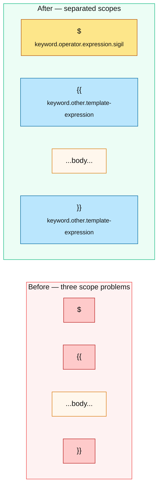

---

### 6.5 Quoted template key dragged "string" theming inside

**Symptom:** `'${{ parameters.x }}'` keys took on the string theme color, so `{{ }}` looked like part of a string literal instead of an expression boundary.

**Why:** The outer `'...'` opened a `string.quoted.single.yaml` scope that nested over the inner expression captures.

**Fix:** In `#template-expression-key-yaml-*-quoted`, scope the outer `'`/`"` as plain `punctuation.definition.string.*` only — drop the broad `string.quoted.*` envelope. See `5d6291a` ("Drop string scope from quoted template-expression keys so {{ }} match unquoted theming") and `c29d2a7` (related stray-quote fix).

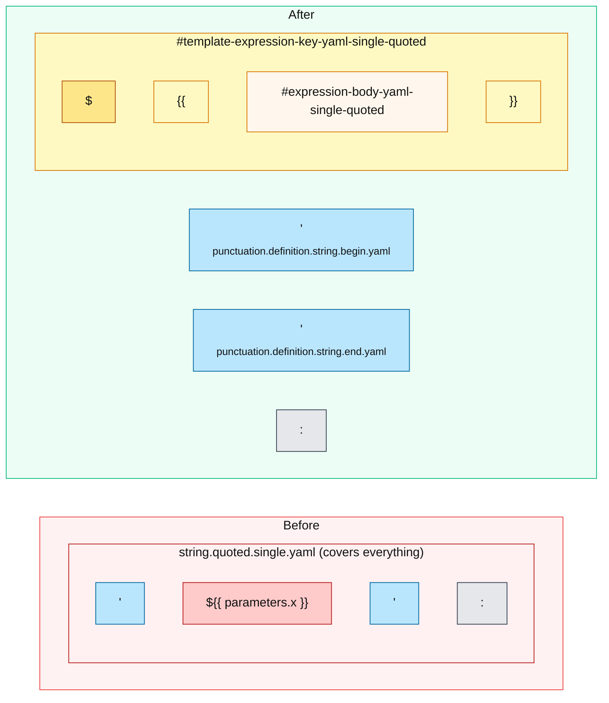

---

### 6.6 Runtime expression `]` closed at the wrong scope

**Symptom:** The closing `]` of `$[ ... ]` did not get the same scope as the opening `[`, so themes couldn't pair them.

**Why:** The end-capture used a slightly different scope name than the begin-capture.

**Fix:** Single-line scope alignment in `e35e27c` ("Fix runtime-expression closing bracket scope"). Visually, both delimiters now share `punctuation.definition.runtime-expression.*.azure-pipelines` and pair correctly.

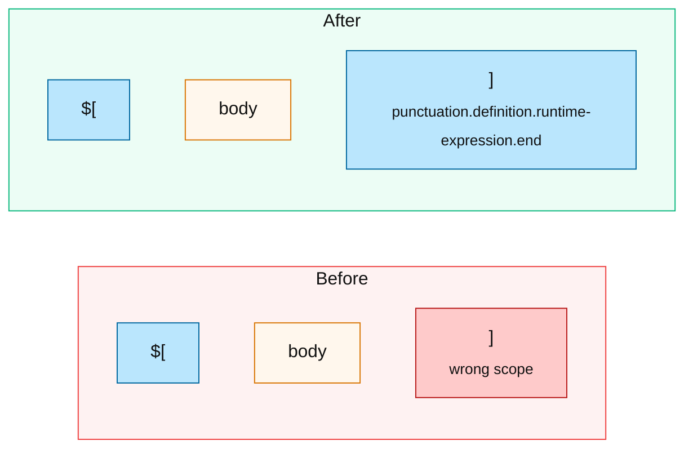

---

### 6.7 Recursion: function calls and brackets re-enter `#expression-body`

Not a "bug" but a deliberate design challenge — Azure Pipelines expressions are nestable (`and(eq(x, succeeded()), startsWith(...))`). Every grouping construct must recurse back into the body grammar without infinite-loop matching empty input.

**Resolution:** `#brackets`, `#builtin-function-call`, `#job-status-function-call` each define a begin/end pair that contains `{ "include": "#expression-body" }`. The base case is a token-level child (`#identifier`, `#literal*`) that consumes at least one character, preventing infinite recursion.

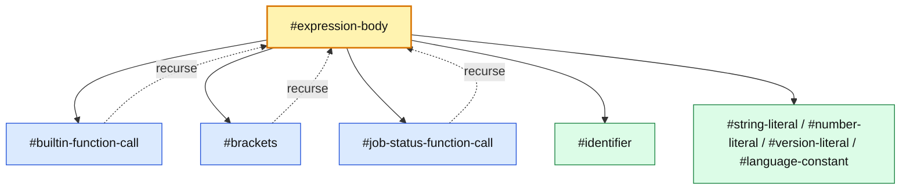

The dashed arrows are the recursion edges; the solid arrows down to `#identifier` and the literal nodes are the terminal cases that always make progress.

## 7) Quick Notes

- Repository size (current file): 61 repository entries, 116 include edges.
- The Azure extension is layered into normal YAML scalar and pair parsing, then dispatches into expression variants.
- Single- and double-quoted expression bodies are mirrored variants of the same core expression language.

## 8) Other Visualization Options

- VS Code: open this Markdown preview to get Mermaid rendering directly.
- Graphviz export: generate DOT from the include graph for a full repository-level dependency map.
- Interactive explorer idea: add a tiny script that emits filtered subgraphs (for example, only nodes reachable from `#flow-node` or `#expressions`).
